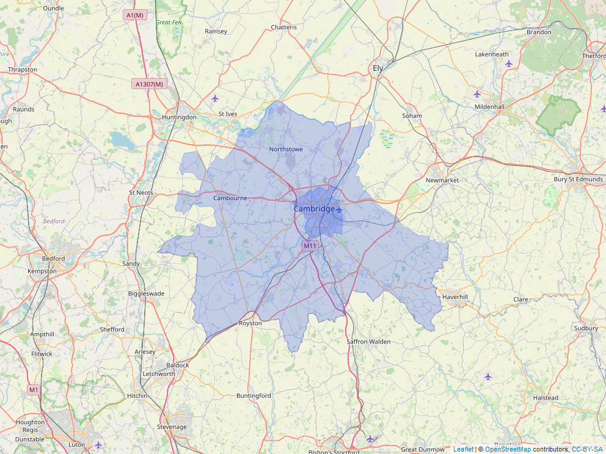

# Police stop and search data extraction

## Black Thrive Global Research Team

## January 2022

# Contents
1. [Overview](#overview)
2. [Packages](#packages)
3. [Coordinates](#coords)
4. [Extraction function](#extraction)

```{r setup, include=FALSE}
knitr::opts_chunk$set(echo = TRUE)
knitr::opts_chunk$set(warning = FALSE)
knitr::opts_chunk$set(include = TRUE)
knitr::opts_chunk$set(message = FALSE)
knitr::opts_chunk$set(results = FALSE)

```

```{r include = TRUE, echo = FALSE}
htmltools::img(src = knitr::image_uri("../images/btg_logo.png"),
               alt = 'logo',
               style = 'position: absolute; top:0; right:0; padding-right:10px; padding-top: 10px; height:118px; width:125px')
```

# Overview <a name = "overview"></a>

This document provides a step by step explanation of a custom R function that retrieves stop and search data for a specified set of Local Authority Districts (LADs) in Britain over a specified time period from the UK Police API. The raw script is available in the same Github directory as this document.

The extraction involves two key steps:

1.  Coordinates defining the geographic boundary of each LAD are extracted from a data file obtained from the Office for National Statistics and formatted in a way that can be used by an extraction function to obtain police data. Other geographic and police force data are added to this coordinate data.
2.  A function uses the formatted coordinates to query the Police API for stop and search records within each LAD over the specified time period.

# Packages <a name = "packages"></a>

```{r}
packages <- c('tidyverse',
              'jsonify', # for reading json
              'leaflet', # for map
              'httr', # for http requests
              'data.table', # for unlisting
              'rgdal', # for geopackage
              'sf', # for geopackage
              'chron', # for dealing with time values
              'mapview', # for saving leaflet maps
              'knitr'
)
pkg_notinstall <- packages[!(packages %in% installed.packages()[,"Package"])]
lapply(pkg_notinstall, install.packages, dependencies = TRUE)
lapply(packages, library, character.only = TRUE)
```

# Coordinates <a name = "coords"></a>

The first part of this script integrates coordinates specifying Local Authority District (LAD) boundaries with county, region, country and Police Force Area data to produce a single list of coordinates containing all of this information. All data were acquired via the Office for National Statistics (ONS) open Geography Portal.

-   [LAD boundaries (December 2021)](https://geoportal.statistics.gov.uk/datasets/ons::local-authority-districts-december-2021-uk-bfe/about)

-   [Ward to LAD to Region to Country (December 2021) Lookup](https://geoportal.statistics.gov.uk/documents/ward-to-local-authority-district-to-county-to-region-to-country-december-2021-lookup-in-united-kingdom/about).

-   [LAD to Community Safe Parterships to Police Force Areas (December 2021) Lookup in England and Wales](https://geoportal.statistics.gov.uk/documents/local-authority-district-to-community-safety-partnerships-to-police-force-areas-december-2021-lookup-in-england-and-wales/about)

## Read data

```{r}
# read boundary data
coords <- geojsonR::FROM_GeoJson("../data/Local_Authority_Districts_(December_2021)_UK_BFE.geojson")

# read list of local authorities
las <- read_csv("../data/ward_la_county_region_country_2021.csv")

# just select by la and get rid of wards 
las_no_ward <- las[!duplicated(las$LAD21NM),] %>%
  select(-c(1:2))

las <- las_no_ward

# list of which forces serve which LADs
forces_df <- read_csv("../data/la_to_force_2020.csv")
# just select by la and get rid of CSPs 
forces_df <- forces_df[!duplicated(forces_df$LAD20NM),] %>%
  select(-c(4:5))

```

```{r}
# check that NI LAs are in this coord set

# targets <- c("Causeway Coast and Glens",
#              "Derry City and Strabane",
#              "Fermanagh and Omagh",
#              "Mid Ulster",
#              "Mid and East Antrim",
#              "Antrim and Newtownabbey",
#              "Armagh City, Banbridge and Craigavon",
#              "Lisburn and Castlereagh",
#              "Belfast",
#              "Ards and North Down",
#              "Newry, Mourne and Down")
# count <- 0
# for(i in 1:374){
#   if(!is.na(match(coords[["features"]][[i]][["properties"]][["LAD21NM"]], targets))){
#     count <- count + 1
#   }
# }
# count
```

## Format coordinates

Here the coordinate list is structured into the appropriate format for the extraction function, adding data on county, region, and country. The script also records missing elements of data (e.g., missing counties, regions, etc.) for manual inspection.

```{r}
# intialise vector for extracted coordinates
coords_extracted <- vector(mode = "list", length = length(coords[["features"]]))

# intialise data frame to record missing data
missing_data_df <- data.frame(setNames(rep(list(NA), 5), c("Index","Name","County_missing","Region_missing","Country_missing")))

for(i in 1:length(coords[["features"]])){
  coords_extracted[[i]][["la_name"]] <- coords[["features"]][[i]][["properties"]][["LAD21NM"]]
  coords_extracted[[i]][["la_code"]] <- coords[["features"]][[i]][["properties"]][["LAD21CD"]]
  #coords_extracted[[i]][["coords"]] <- lapply(coords_extracted[[i]][["coords"]][[1]], unlist)
  
  # add la, county, region, and country names
  try(
    coords_extracted[[i]][["county"]] <- as.character(las[which(las$LAD21CD == coords_extracted[[i]][["la_code"]]), "CTY21NM"])
  )
  try(
    coords_extracted[[i]][["region"]] <- as.character(las[which(las$LAD21CD == coords_extracted[[i]][["la_code"]]), "RGN21NM"])
  )
  try(
    coords_extracted[[i]][["country"]] <- as.character(las[which(las$LAD21CD == coords_extracted[[i]][["la_code"]]), "CTRY21NM"])
  )
  try(
    coords_extracted[[i]][["force"]] <- as.character(forces_df[which(forces_df[,"LAD20CD"] == coords_extracted[[i]][["la_code"]]), "PFA20NM"])
  )
  
  if(coords_extracted[[i]][["force"]] == "character(0)"){
    coords_extracted[[i]][["force"]] <- NA
  }
  names(coords_extracted)[i] <- coords_extracted[[i]][["la_name"]]
  
  coords_extracted[[i]][["coords"]] <- coords[["features"]][[i]][["geometry"]][["coordinates"]]

  # report which LAs have missing values 
  if(is.na(coords_extracted[[i]][["county"]])){
    #print(paste0(names(coords_extracted)[i], " county missing (", i, ")"))
    missing_data_df[i, "Index"] <- i
    missing_data_df[i, "Name"] <- coords_extracted[[i]][["la_name"]]
    missing_data_df[i, "Country"] <- coords_extracted[[i]][["country"]]
    missing_data_df[i, "County_missing"] <- 1
  }
  if(is.na(coords_extracted[[i]][["region"]])){
    #print(paste0(names(coords_extracted)[i], " region missing (", i, ")"))
    missing_data_df[i, "Index"] <- i
    missing_data_df[i, "Name"] <- coords_extracted[[i]][["la_name"]]
    missing_data_df[i, "Country"] <- coords_extracted[[i]][["country"]]
    missing_data_df[i, "Region_missing"] <- 1
  }
  if(is.na(coords_extracted[[i]][["country"]])){
    #print(paste0(names(coords_extracted)[i], " country missing (", i, ")"))
    missing_data_df[i, "Index"] <- i
    missing_data_df[i, "Name"] <- coords_extracted[[i]][["la_name"]]
    missing_data_df[i, "Country"] <- coords_extracted[[i]][["country"]]
    missing_data_df[i, "Country_missing"] <- 1
  }
  if(is.na(coords_extracted[[i]][["force"]])){
    #print(paste0(names(coords_extracted)[i], " country missing (", i, ")"))
    missing_data_df[i, "Index"] <- i
    missing_data_df[i, "Name"] <- coords_extracted[[i]][["la_name"]]
    missing_data_df[i, "Country"] <- coords_extracted[[i]][["country"]]
    missing_data_df[i, "Force_missing"] <- 1
  }

  
  for(j in 1:length(coords_extracted[[i]][["coords"]])){
    if(is.list(coords_extracted[[i]][["coords"]][[j]])){
      coords_extracted[[i]][["coords"]] <- lapply(coords_extracted[[i]][["coords"]][[1]], unlist)
    }
    
  }
  
}

# drop rows from missing_data_df that are NA
missing_data_df <- missing_data_df[rowSums(is.na(missing_data_df)) != ncol(missing_data_df),]


# unlist coordinates to make them correct format for function
coords_extracted_unlisted <- coords_extracted

# check depth of coord lists to check that coords have been unlisted successfully
# count should be 0
count <- 0
for(i in 1:length(coords_extracted_unlisted)){
  for(j in 1:length(coords_extracted_unlisted[[i]][["coords"]])){
    if(is.list(coords_extracted_unlisted[[i]][["coords"]][[j]][[1]])){
      count <- count + 1
    }
  }
}
count

# make coords dataframe and label colnames
for(i in 1:length(coords_extracted_unlisted)){
  for(j in 1:length(coords_extracted_unlisted[[i]][["coords"]])){
      coords_extracted_unlisted[[i]][["coords"]][[j]] <- as.data.frame(coords_extracted_unlisted[[i]][["coords"]][[j]])
      colnames(coords_extracted_unlisted[[i]][["coords"]][[j]]) <- c("long","lat")
  }
}

## Reorder coordinates so that multiple polygon areas are processed last

# This is a non-essential step that helps with processing. It orders the coordinates so that those LADs with multiple coordinate polygons (e.g. those LADs that include many islands) are extracted last. This helps ensure that, in the case of an extraction failure, there is a high likelihood that most LADs have already been acquired. To elaborate, because multiple polygon areas take a long time to check and extract, it is preferable that they are extracted last, after the bulk of other data is already acquired. Not doing so would result in long processing times with little extraction progress if there are failures.

# reorder coord list so that multiple polygon areas are last
coord_lengths <- matrix(nrow = length(coords_extracted_unlisted), ncol = 2)
# make list of lengths of each element in coord list
for(i in 1:length(coords_extracted_unlisted)){
  coord_lengths[i,1] <- i
  coord_lengths[i,2] <- length(coords_extracted_unlisted[[i]][["coords"]])
}
# order coord indexes based on coord element length
coord_lengths_ordered <- coord_lengths[order(coord_lengths[,2]),]

# order coord list based on ordered coord indexes
ordered_coords <- list()
for(i in 1:length(coords_extracted_unlisted)){
  ordered_coords[[i]] <- coords_extracted_unlisted[[coord_lengths_ordered[i]]]
  names(ordered_coords)[i] <- names(coords_extracted_unlisted)[coord_lengths_ordered[i]]
}


```

## Missing force data

By checking 'missing_data_df' and sorting by 'Force_missing' column, it is possible to quickly identify that the areas that are missing data are Scotland, Northern Ireland, and Northamptonshire. Scotland and NI are missing because they have their own devolved Police services. Northamptonshire is missing because of a mismatch of census codes with the newly defined LADs North and West Northamptonshire. The code below manually adds the missing data.

```{r}
for(i in 1:length(ordered_coords)){
  if(is.na(ordered_coords[[i]][["force"]])){
    if(ordered_coords[[i]][["country"]] == "Scotland"){
      ordered_coords[[i]][["force"]] <- "Police Scotland"
    }
    else if(ordered_coords[[i]][["country"]] == "Northern Ireland"){
      ordered_coords[[i]][["force"]] <- "Police Service of Northern Ireland"
    }
    else{
      ordered_coords[[i]][["force"]] <- "Northamptonshire"
    }
  }
}

# check that there are no more missing forces
count <- 0
for(i in 1:length(ordered_coords)){
  if(is.na(ordered_coords[[i]][["force"]])){
    count <- count + 1
  }
}
print(paste0(count, " missing forces remain"))
```

Inspection of the resultant coordinate definitions showed that the LAD South Cambridgeshire also included the LAD Cambridge:

```{r results = TRUE}
sc_coords <- ordered_coords[["South Cambridgeshire"]]

all_coords <- c()
for(i in 1:length(sc_coords[["coords"]])){
  iteration_coords <- sc_coords[["coords"]][[i]]
  all_coords <- rbind(all_coords, iteration_coords, c(NA, NA))
}

map <- leaflet(as.matrix(all_coords)) %>% 
  addPolygons(weight = 0.5) %>% 
  addTiles()

mapshot(map, file = "../images/cambridge_map.png")

```

```{r results = TRUE, fig.align='center'}

```

To avoid repeated retrieval of Cambridge stops (dark blue area above), its coordinates were removed from the South Cambridgeshire element (light blue above). In this way, stops could be retrieved independently for Cambridge and South Cambridgeshire. It should be noted that in analyses involving aggregating over LADs, this overlap must be accounted for. This can be done by removing the Cambridge stops from the dataset and keeping the broader South Cambridgeshire stops.

```{r}
# remove repeat cambridge within south cambridgeshire
ordered_coords[["South Cambridgeshire"]][["coords"]] <- ordered_coords[["South Cambridgeshire"]][["coords"]][-2]
```

```{r}
# save / load previously defined coords 
# save(ordered_coords, file = "../data/ordered_coords.Rdata")
# load("../data/ordered_coords.Rdata")
```

# Extraction function <a name = "extraction"></a>

This part of the script specifies and runs the function used to extract data from the Police API. It takes the formatted coordinates acquired above and queries the Police API via POST request for stop and search data for each LAD over a period of time specified by the user.

**Syntax**: `la_search_police_api(coord_list, most_recent_month = NULL, most_recent_year = NULL, num_months_backwards = 12, back_to_month = NULL, back_to_year = NULL, wait_time = 5, max_tries = Inf)`

The function starts from the most recent month of interest (either manually specified or determined by the latest API update) and works backwards month by month to acquire data for each LAD for each month of interest over the specified period. By default, the function starts from the most recent API update and works backwards 12 months. However, the user can specify any date range required up to a maximum of 36 months (this is the cutoff set by the API itself).

The oldest available date can be acquired by querying the API:

```{r results = TRUE}
# get oldest date live
oldest <- httr::GET("https://data.police.uk/api/crimes-street-dates")
k <- content(oldest)
l <- lapply(k, unlist)
m <- do.call(bind_rows, l)

# format as date to be able to use min/max functions 
for(i in 1:nrow(m)){
  m$date[i] <- paste0(m$date[i],"-01")
}
m$date <- as.Date(m$date)
print(paste0("Oldest date available: ", substr(min(m$date), 1, 7)))
print(paste0("Most recent date available: ", substr(max(m$date), 1, 7)))

print(paste0("Range: ", max(m$date) - min(m$date), " days (",as.numeric(max(m$date) - min(m$date)) / 30, " months)"))
```

The only mandatory input of the function is the list of coordinates, which must be formatted using the preceding code. The user can also specify a subset of coordinates.

**Input arguments**:

-   `coord_list` (**required**): The list of coordinates formatted using the above code. List.
-   `most_recent_month`: The most recent month of interest. Numeric value (e.g., 8 for August). If NULL, the function will determine this based on the most recent API update.
-   `most_recent_year`: The most recent month of interest. Numeric value (e.g., 2021). If NULL, the function will determine this based on the most recent API update.
-   `num_months_backwards`: The number of months backwards from the start point for which to acquire data. Numeric value. Default is 12. Maximum is 36 (limit imposed by API).
-   `back_to_month`: Instead of specifying `num_months_backwards`, the user can specify the oldest month of interest. Numeric value (e.g., 8 for August).
-   `back_to_year`: As above, the user can specify the oldest year of interest. Numeric value (e.g., 2019).
-   `wait_time`: If there is a server error when submitting POST request, the function will wait `wait_time` seconds before retrying. Numeric value. Default is 5.
-   `max_tries`: This specifies the maximum number of times to retry a failed POST request. Numeric value. Default is Infinite, i.e., it will keep trying until it succeeds. This is because failures are usually due to timeouts that are resolved by retrying.

**Outputs**:

The function's output is a List of 3 elements:

1.  `result`: This is the data frame containing the acquired stops. Can be assigned as a named data frame using, e.g., if function output has been called `data`, data frame can be assigned as `df <- data[[1]]`.
2.  `missing_entries`: Data frame which records any LADs for which no data was acquired.
3.  `server_errors`: Data frame which records any unresolved server errors (i.e., cases where the function stopped trying the POST request).

The function also automatically saves a List called `save_progress.Rdata`, which updates every time data acquisition for a LAD is complete. This allows the user to retrieve the progress made on a run if it fails. This List contains the same data as above, plus an addition element called `last_area_acquired` which provides the index of the last LAD acquired. The user can use this information to restart the function from the next LAD and later combine the resultant data frames.

Finally, for redundancy, on completion the function saves the final output as `full_extraction.Rdata` so that acquired data is not accidentally lost if the workspace is not saved.

**Example usage**:

`data <- la_search_police_api(ordered_coords, back_to_month = 1, back_to_year = 2019)`

This usage will acquire data for all LADs from the most recent API update back to January 2019.

`data <- la_search_police_api(ordered_coords, most_recent_month = 8, most_recent_year = 2021)`

This usage will acquire data for all LADs for the 12 months to August 2021.

```{r}
la_search_police_api <- function(coord_list, 
                                 most_recent_month = NULL, 
                                 most_recent_year = NULL, 
                                 num_months_backwards = 12,
                                 back_to_month = NULL,
                                 back_to_year = NULL,
                                 wait_time = 5, 
                                 max_tries = Inf){
  # initialise dataframes
  overall_output <- data.frame()
  no_entries_df <- data.frame(setNames(rep(list(NA), 6), c("Index","Name","County","Region","Country","Force")))
  server_error_df <- data.frame(setNames(rep(list(NA), 9), c("Index","Name","County","Region","Country","Force","Date","Date Index", "Status Code")))
  
  # h loop iterates over LAs
  for(h in 1:length(coord_list)){
    print(paste0("Started area ", h)) # report start (useful for debugging)
    
    la_name <- coord_list[[h]][["la_name"]] # LA name
    la_code <- coord_list[[h]][["la_code"]] # la census code
    
    county <- coord_list[[h]][["county"]] # county name
    if(is_empty(county)){
      county <- NA # set NA if missing
    }
    
    region <- coord_list[[h]][["region"]] # region name
    if(is_empty(region)){
      region <- NA # set NA if missing
    }
    
    country <- coord_list[[h]][["country"]] # country name
    
    force <- coord_list[[h]][["force"]]
    
    # get most recent update if most_recent data not specified
    if(is.null(most_recent_month) || is.null(most_recent_year)){ 
      # get most recent update from API:
      date <- httr::content(
        httr::GET("https://data.police.uk/api/crimes-street-dates"))[[1]][["date"]] 
      most_recent_month <- as.numeric(substr(date,6,7))
      most_recent_year <- as.numeric(substr(date,1,4))
    }
    else{
      most_recent_month <- most_recent_month
      most_recent_year <- most_recent_year
    }
    
    # calculate num_months_backwards if it wasn't specified
    if(is.null(num_months_backwards)){
      num_months_backwards <- 1 + (12 * (most_recent_year - back_to_year)) + (most_recent_month - back_to_month)
    }
    
    area_output <- data.frame() # initialise area output df
    number_months_acquired <- 0 # initialise number of months acquired counter
    
    # i loop iterates over the months required 
    for(i in 1:num_months_backwards){
      month_output <- data.frame()
      # format date to what is needed for API query ("yyyy-mm")
      if(i == 1){ # set values for first iteration
        month_num <- most_recent_month
        year <- most_recent_year
      }
      else{ # subsequent iterations
        month_num <- month_num - 1 # backwards a month each iteration
        if(month_num %% 12 == 0){ # if reach a new year, start months from 12 again
          month_num <- 12
          year <- year - 1 # backwards a year
        }
      }
      if(month_num < 10){ # paste 0 for months lower than 10
        month <- paste("0", month_num, sep = "")
      }
      else{
        month <- month_num
      }
      
      date <- paste(year, "-", month, sep = "") # combine dates into one string
      
      # j loop iterates over the coordinate sets within each LA and creates a
      # polygon string to be searched, and then submits the query.
      # Most LAs have only one coordinate set, but some have multiple (e.g., 
      # those that include islands). The function therefore needs to search 
      # each coordinate set within a LA separately.
      coord_string <- c() # initialise vector for coord string
      for(j in 1:length(coord_list[[h]][["coords"]])){
        # set this iteration's coordinate set:
        area_coords <- coord_list[[h]][["coords"]][[j]]
        # combine coord strings into format required by API (much quicker than looping):
        coord_string <- paste0(area_coords$lat,",",area_coords$long, collapse = ":") 
        
        # create body for post request
        body <- list("poly" = coord_string,
                     "date" = date)
        # search API for this coordinate set and date:
        post_request <- httr::POST("https://data.police.uk/api/stops-street?", body = body)
        
        # if search quota reached, break (shouldn't be an issue but just in case)
        if(post_request[["status_code"]] == 429){
          print("Quota reached. Abandoning request.")
          break
        }
        else{
          # if the request didn't succeed, wait some time ('wait_time') and 
          # keep trying up until 'max_tries' attempts.
          attempt <- 1
          while(post_request[["status_code"]] != 200 && attempt <= max_tries){ 
            print(paste0("Server error. Trying again (", attempt,")"))
            Sys.sleep(wait_time) # wait some time before trying again
            try(
              post_request <- httr::POST("https://data.police.uk/api/stops-street?", body = body)
            )
            # if search quota reached, break (shouldn't be an issue but just in case)
            if(post_request[["status_code"]] == 429){ 
              print("Quota reached. Abandoning request.")
              break
            }
            attempt <- attempt + 1
          }
          # once max_tries is met, give up retry, save info including status code
          if(post_request[["status_code"]] != 200 && attempt > max_tries){
            print(paste0("Max tries reached (", max_tries,"). Continuing."))
            if(is.na(server_error_df[1,1])){ # if first occurrence, replaces NAs 
              server_error_df[1,] <- c(h, la_name, county, region, country, force, date, i, post_request[["status_code"]])
            }
            else{ # rbind subsequent occurrences
               server_error_df <- rbind(server_error_df, c(h, la_name, county, region, country, force, date, i, post_request[["status_code"]]))      
            }
          }
        }
        
        # get data from results of query
        df <- httr::content(post_request) 
        # unlist data and convert to dataframe:
        df_2 <- lapply(df, unlist)
        df_3 <- do.call(bind_rows, df_2)
        df_3$coord_set <- j # record which coordinate set data is from
        
        # add results of this coordinate set iteration (j) to the output for 
        # this month iteration (i). Use bindrows for (high) possibility that columns
        # from different iterations will be in different order/missing
        #area_output <- bind_rows(area_output, df_3) 
        month_output <- bind_rows(month_output, df_3)
        
        cat("\014") # clear console 
        # report overall (i.e., LA) progress
        print(paste0("Working... LA ", h, " of ", length(coord_list), 
                     " (", 
                     round(100 * (h / length(coord_list)), 2), "%)"))
        # report month progress
        print(paste0("Working... Month ", i, " of ", num_months_backwards, 
                     " (", date, ")"))
        # report coordinate set progress
        print(paste0("Working... ", j, " of ", 
                     length(coord_list[[h]][["coords"]]), 
                     " coordinate sets retrieved"))

        
      } # coordinate set loop (j) ends
    
      # if records have been acquired, increase months count
      if(nrow(month_output) > 0){
         number_months_acquired <- number_months_acquired + 1
      }
      
      # add data from this month to overall LA output
      area_output <- bind_rows(area_output, month_output)
      
    } # month loop (i) ends
    
    
    
    # If there were no records for this LA, record the LA iteration number
    # and name, then proceed to the next LA
    if(nrow(area_output) == 0){
      if(is.na(no_entries_df[1,1])){ # if first occurrence, replaces NAs 
        no_entries_df[1,] <- c(h, la_name, county, region, country, force)
      }
      else{ # rbind subsequent occurrences
        no_entries_df <- rbind(no_entries_df, c(h, la_name, county, region, country, force))        
      }
      print(paste0("No records for ", la_name))
      next # proceed to next LA
    }
    
    # add columns for LA name, county, region, country, and the iteration index
    # for the LA (useful for quickly identifying which LA the function reached 
    # if it breaks unexpectedly)
    area_output$la_name <- la_name
    area_output$la_code <- la_code
    area_output$county <- county
    area_output$region <- region
    area_output$country <- country
    area_output$index <- h
    area_output$number_months_acquired <- number_months_acquired
    area_output$proportion_months_acquired <- number_months_acquired / num_months_backwards
    area_output$force <- force
    
    # separate datetime into 2 columns
    area_output$time <- substr(area_output$datetime, 12, 19)
    area_output$date <- as.Date(substr(area_output$datetime, 1, 10))
    # set as time
    #area_output$time <- chron(times. =  df$time, format = c(times = "hh:mm:ss"))
    
    # move index and location data to front of df
    area_output <- area_output %>%
      select(index, 
             la_name, 
             la_code, 
             county, 
             region, 
             country, 
             force, 
             date,
             time,
             age_range, 
             gender, 
             self_defined_ethnicity, 
             officer_defined_ethnicity, 
             object_of_search,
             legislation,
             outcome,
             outcome_linked_to_object_of_search,
             type,
             involved_person,
             removal_of_more_than_outer_clothing,
             operation,
             location.longitude,
             location.latitude,
             location.street.id,
             location.street.name,
             everything()) %>%
      subset(., select = -c(datetime, outcome_object.id, outcome_object.name)) # get rid of redundant columns

    overall_output <- bind_rows(overall_output, area_output)
    

    
    # create a temporary output list and save it every time a LA completes, so
    # that there is a backup in case function breaks. Saves to same folder as
    # script
    save_progress <- list(result = overall_output,
                          missing_entries = no_entries_df,
                          server_errors = server_error_df,
                          last_area_acquired = h)
    save(save_progress, file = "./save_progress.Rdata")
  } # LA loop (h) ends
  
  final_output <- list(result = overall_output,
              missing_entries = no_entries_df,
              server_errors = server_error_df)
  
  save(final_output, file = "./full_extraction.Rdata")
  
  # return output. 'result' is the data. 'missing_entries' provides a list of
  # LAs that are missing from the data because there were no records for the 
  # LA in the specified time period.
  return(final_output)

}

```

## Run function

```{r eval = FALSE}
data <- la_search_police_api(ordered_coords, back_to_month = 1, back_to_year = 2019)
```

The variables within the `results` data frame are:

-   `index`: Number describing order of Local Authority Districts (LADs) in coordinate list
-   `la_name`: LAD name
-   `la_code`: LAD census code
-   `county`: County of LAD
-   `region`: Region of LAD
-   `country`: Country of LAD
-   `force`: Police Force serving LAD
-   `date`: Date
-   `time`: Time
-   `age_range`: Age (range) of person stopped
-   `gender`: Gender of person stopped
-   `self_defined_ethnicity`: Ethnicity as defined by the person stopped
-   `officer_defined_ethnicity`: Ethnicity as defined by the officer
-   `object_of_search`: Reason for the stop
-   `legislation`: Legislation justifying the stop
-   `outcome`: Result of stop
-   `outcome_linked_to_object_of_search`: Boolean. Whether or not the outcome of the stop was related to reason for the stop
-   `type`: Type of search (person/vehicle/person & vehicle)
-   `involved_person`: Boolean. Whether or not stop involved a person
-   `removal_of_more_than_outer_clothing`: Boolean. Whether or not more than outer clothing was removed
-   `operation`: Boolean. Whether stop was linked to a police operation
-   `location.longitude`: Longitude of location of stop
-   `location.latitude`: Latitude of location of stop
-   `location.street.id`: Street ID of location of stop
-   `location.street.name`: Street name of location of stop
-   `coord_set`: Index of the coordinate set of the LAD from which the stop record was acquired.
-   `number_months_acquired`: Number of months acquired for this LAD.
-   `proportion_months_acquired`: Number of months acquired for this LAD as a proportion of the total number of months requested.
